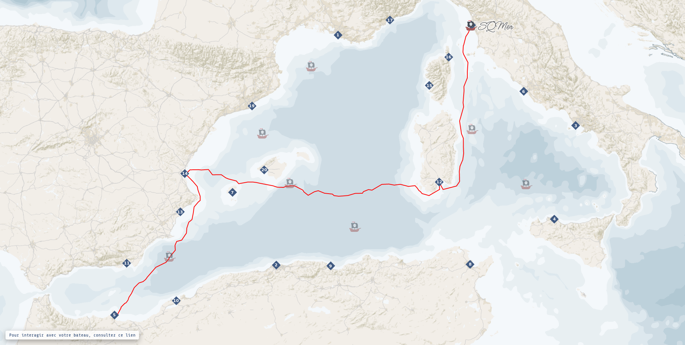

# CarthaPirates

CarthaPirates est une application utilisée dans le cadre des cours d'Algorithmie et de Programmation assurés au sein du Master 2 Carthagéo :

* Université Panthéon-Sorbonne (Paris 1)
* Université de Paris Cité (Paris 7)
* École Nationale des Sciences Géographiques (ENSG)

---

## 1. Architecture logicielle de l'application

L'application, proposée sous la forme d'une composition Docker, est composée de trois services :

 * une base de données (service *db*)
 * une API REST (service *api*)
 * une application web (service *front*)

### 1.1 Service *db*

La base de données utilisée est une base de données **PostgreSQL**.

Les extensions suivantes sont ajoutées : **PostGIS**, pour les données et les traitements géographiques, et **PgRouting**, pour les calculs d'itinéraires optimisés.

Image utilisée : `FROM pgrouting/pgrouting`

### 1.2 Service *back*

L'API REST est une API utilisant **Node.js** et **Express**. Son rôle est de permettre la consommation de la base de données du service *db* (grâce à l'ORM **Sequelize**) par les différents clients, dont le service *front*. Sa documentation est assurée par **Swagger UI**.

Image utilisée : `FROM node:12`

### 1.3 Service *front*

L'application web utilise **Nginx** et consomme le service *api*. Elle est codée avec les langages **HTML5**, **CSS3** et **Javascript**. Elle utilise notamment deux librairies JS : **jQuery 3**, pour la manipulation du DOM et la consommation de l'API REST
 * **OpenLayers 6**, pour le composant cartographique

Image utilisée : `FROM nginx:alpine`

---

## 2. Démarrage de l'application

### 2.1 Pour un environnement (local) de développement

Arrêter et nettoyer l'environnement de développement avec la commande `make cleanDev`.

Puis, démarrer l'application avec la commande `make startDev` ou `make watchDev`.

Les services suivants sont alors accessibles :

* [localhost:9000](http://localhost:9000/) : service *front*
* [localhost:9001](http://localhost:9001/documentation/) : service *api*
* localhost:9002 : service *db*

### 2.2 Pour l'environnement de production

Arrêter et nettoyer l'environnement de production avec la commande `make clean`.

Puis, démarrer l'application avec la commande `make start` ou `make watch`.

Les services suivants sont alors accessibles :

* [carthapirates.fr](https://carthapirates.fr/) : service *front*
* [carthapirates.fr/api](https://carthapirates.fr/api/documentation) : service *api*

L'application est hébergée en France ([ScaleWay](https://www.scaleway.com/fr/)).