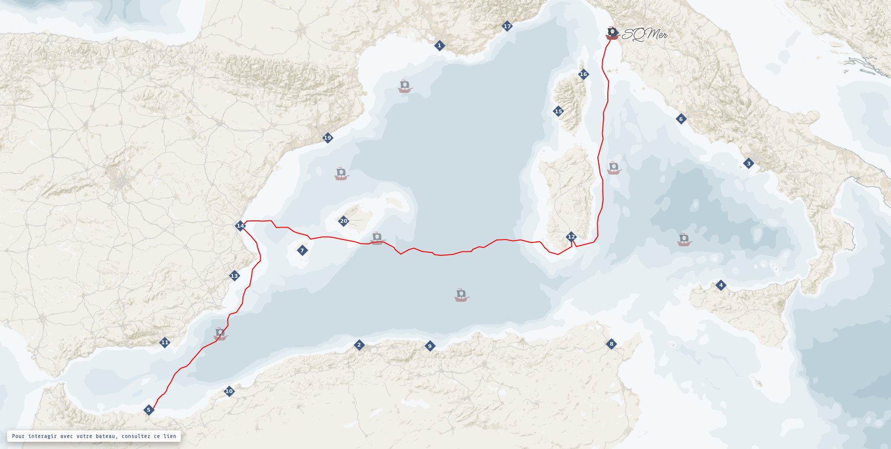

# Interagir avec la carte en Python

La carte interactive est visible ici : https://carthapirates.fr/
Si vous voulez focaliser la carte interactive sur un seul bateau : https://carthapirates.fr/?bateau=1

Pour rappel, l’utilisation de la carte interactive au travers de votre programme n’est pas obligatoire ! Par contre, si vous décidez de l'utiliser, sachez que cela nécessite d’être connecté à Internet pendant tout le temps d'éxécution de votre programme.

Afin de vous aider à utiliser la carte, vous trouverez dans ce dossier "python" deux fichiers .py mis à votre disposition :

**Fichier CarthaPirates.py**

Ce premier fichier est à ajouter à votre projet, au même endroit que les autres classes de votre projet (Navire, Equipage, Navigateur, etc.), de préférence à la racine du répertoire de votre projet.

**Fichier exemple.py**

Ce second fichier vous montre comment vous devez importer la classe CarthaPirates. Il vous montre aussi comment utiliser cette les méthodes de cette classe CarthaPirates au sein de votre programme, et ce afin d'interagir avec votre bateau au sein de la carte interactive.